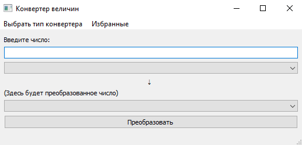
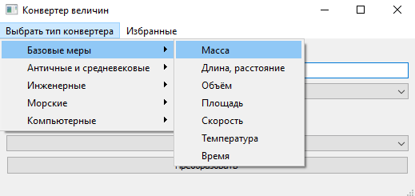
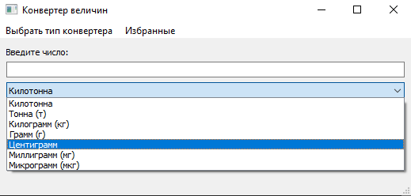
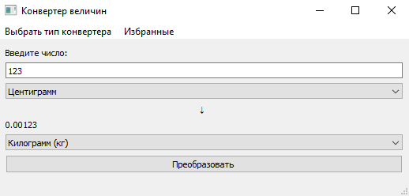
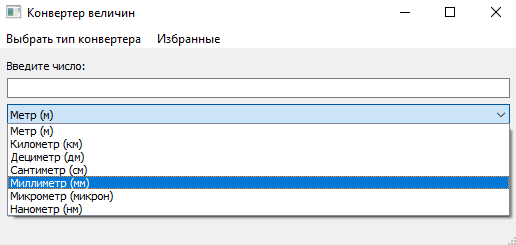
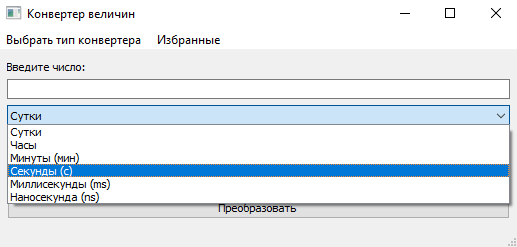
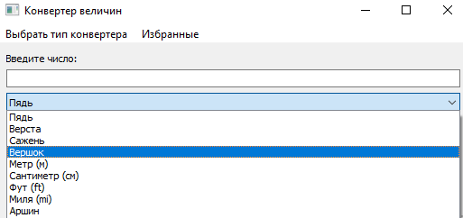
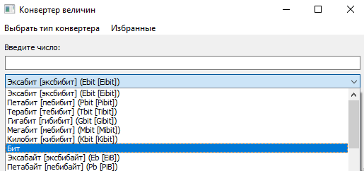
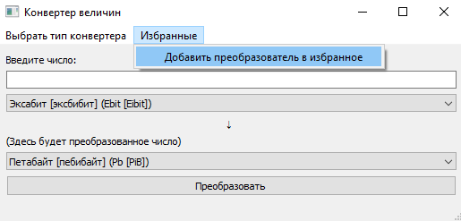

## Конвертер величин

###Я сделал программу **"Конвертер величин"**, куда добавил 18 типов преобразователей.

-----------

###Запустив программу, перед вами встаёт выбор типа конвертера, а также самого преобразователя величин:

###Выбираем тип и преобразователь.

###После нужно выбрать величины:

###В поле ввода вписать нужное нам число и нажать на кнопку "Преобразовать".

---

### Всего в моей программе 105 самых различных величин. Начиная метрами и сантиметрами, заканчивая эксабитами и петабайтами...

----

###Также в моём конвертере величин имеется система добавления той или иной величины в "избранные".
###Для этого нужно:
###1. Выбрать нужный конвертер
###2. Нажать на кнопку "Избранные" и уже затем добавить сам преобразователь в избранные.

